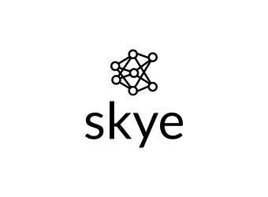

#### Python version
> python3 --version

> Python 3.10.12

--------------------
#### System dependencies

> apt-cache policy python3.10-venv python3-dev libssl-dev gcc build-essential swig

> sudo apt-get install python3.10-venv python3-dev libssl-dev gcc build-essential swig

--------------------
#### Project preparations
Create virtual environment
> python3 -m venv venv

Activate virtual environment
> . venv/bin/activate

Update pip
> python3 -m pip install --upgrade pip

Install required packages
> pip install -r requirements.txt

Deactivate virtual environment
> deactivate venv

--------------------
#### Required packages
> requirements.txt

```
python-socketio
uvicorn
```

--------------------
#### Start server
> uvicorn --host 127.0.0.1 --port 5000 app:app --reload

--------------------